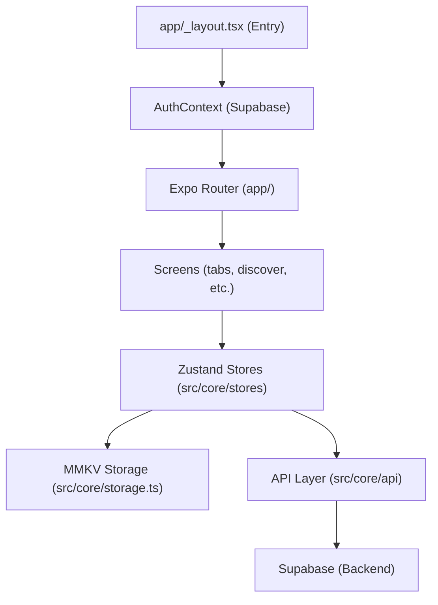

# Architecture

> Auto-generated by /map on 2026-01-18

## Overview

Crispy Native is a React Native media center application built with Expo. It aims to provide a centralized media experience (like Stremio) with support for catalogs, streaming, and metadata synchronization via Supabase and Trakt.

## Components

### Routing & Navigation
- **Purpose:** Manages app screens and transitions.
- **Location:** `app/`
- **Technology:** Expo Router (File-based routing).

### State Management
- **Purpose:** Handles application state (User, Settings, Addons).
- **Location:** `src/core/stores/`
- **Technology:** Zustand.

### Persistence (Local Storage)
- **Purpose:** High-performance local key-value storage.
- **Location:** `src/core/storage.ts`
- **Technology:** React Native MMKV. Includes user-scoped namespacing (`u_{userId}:`).

### Backend Integration
- **Purpose:** User authentication and cloud data synchronization.
- **Location:** `src/core/api/supabase.ts`, `src/core/AuthContext.tsx`
- **Technology:** Supabase.

### Design System
- **Purpose:** UI components and styling.
- **Location:** `src/cdk/`, `src/styles/`
- **Technology:** NativeWind (Tailwind CSS), Lucide React Native.

## Data Flow

1. **Initialization:** `RootLayout` initializes `AuthProvider`.
2. **Auth:** `AuthContext` listens to Supabase auth state. On login, it sets the `active_user_id` in `StorageService`.
3. **Hydration:** Zustand stores (like `useUserStore`) hydrate data from MMKV (local) and eventually sync from Supabase (remote).
4. **Interaction:** UI components trigger store updates, which persist locally and sync to the cloud.

## Integration Points

| Service | Type | Purpose |
|---------|------|---------|
| Supabase | API/Auth | User profiles, settings sync, addon sync |
| Trakt.tv | OAuth/API | Watch history, watchlist synchronization |
| TMDB/OMDB | API | Metadata for movies and series |

## Technical Debt

- [ ] **Empty/Placeholder Dir:** `src/app/` coexists with the active `app/` directory.
- [ ] **Missing Player Implementation:** `src/features/player` exists but full integration with native playback (like MPV or ExoPlayer) is not yet verified.
- [ ] **Env Vars:** Supabase keys are currently hardcoded with fallbacks in `supabase.ts`.
- [ ] **Outdated Packages:** Tailwind CSS v3 is used while v4 is available.
